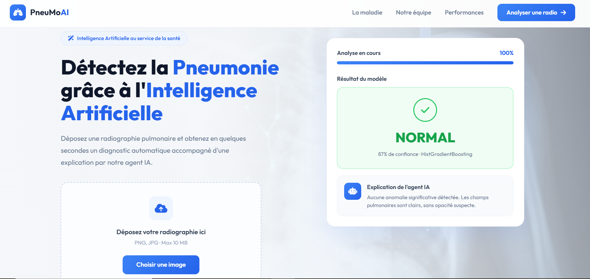
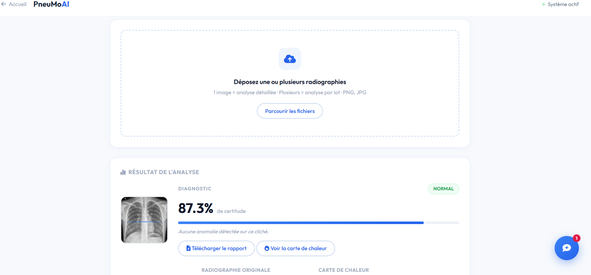
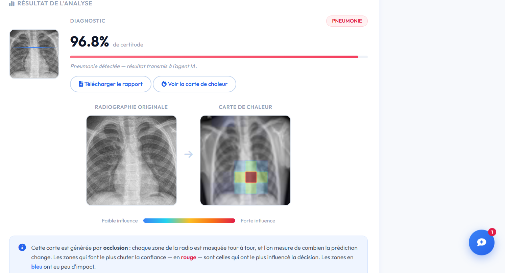

# 🫁 PneumoIA

Bonjour ! Je vous présente **PneumoIA**, un projet réalisé en 2 mois : la détection de pneumonie par intelligence artificielle à partir de radiographies pulmonaires.

L'utilisateur dépose une radiographie, le modèle prédit le diagnostic (NORMAL ou PNEUMONIE) avec un score de confiance, et un assistant IA explique le résultat de façon pédagogique. Une carte de chaleur explicable montre les zones analysées par le modèle.

**Technologies :** Python · Flask · scikit-learn (HistGradientBoosting) · HTML/CSS/JavaScript
Projet L3 IAA — Aix-Marseille Université

---

## ⚠️ Important : télécharger le dataset

Le dataset est trop volumineux pour être inclus directement dans ce dépôt Git. **Il faut le télécharger séparément et l'ajouter au projet** pour faire fonctionner l'application.

1. Téléchargez le dataset sur Kaggle :
   👉 https://www.kaggle.com/datasets/paultimothymooney/chest-xray-pneumonia

2. Décompressez-le et placez le dossier `chest_xray` dans le projet, de façon à obtenir cette structure :
   PneumoIA/

├── archive/

│   └── chest_xray/

│       ├── train/

│       │   ├── NORMAL/

│       │   └── PNEUMONIA/

│       └── test/

│           ├── NORMAL/

│           └── PNEUMONIA/

├── app.py

└── ...
3. Lancez l'entraînement du modèle : python entrainer_modele.py

Sans ce dataset, l'entraînement ne peut pas fonctionner.

---

## 🖥️ Aperçu de l'application

### Page d'accueil

La page d'accueil présente le projet et permet de démarrer une analyse. On y retrouve une démonstration du résultat du modèle et l'explication de l'agent IA.

### Page d'analyse (téléversement)

Une zone d'upload unique : déposer **une seule** radiographie lance une analyse détaillée, **plusieurs** radiographies lancent une analyse par lot.

### Résultat et carte de chaleur

Le diagnostic s'affiche avec son score de confiance. La carte de chaleur (générée par occlusion) met en évidence les zones de la radiographie qui ont le plus influencé la décision du modèle (rouge = forte influence, bleu = faible influence).

---

## 🚀 Lancer le projet

4. Installer les dépendances : pip install flask flask-cors pillow numpy joblib scikit-learn google-genai python-dotenv
5. Lancer l'application :python app.py
6.  Ouvrir http://127.0.0.1:5000 dans le navigateur.

